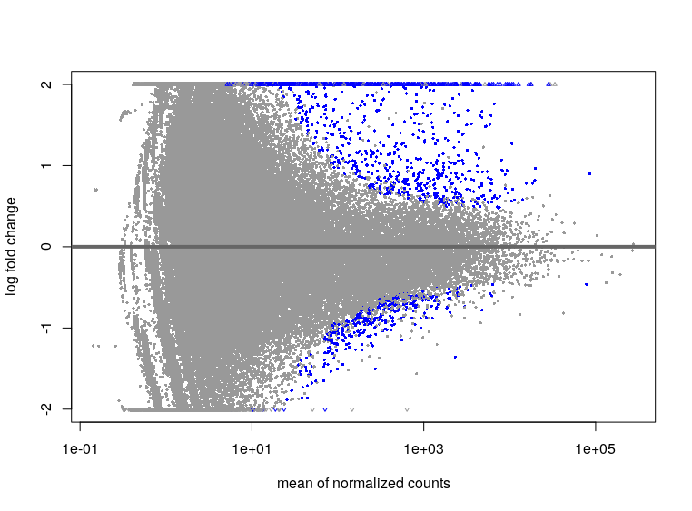

---
output:
  html_document: default
  pdf_document: default
---

# Characterization of the interferon response in a microbat species

## Introduction

Bats are frequently exposed to  a large spectrum of viruses but seem asymptomatic. Specific bats immune responses would have developed with a long-term cohabitation with viruses to reach an equilibrium between viral resistance and tolerance. This high tolerance to viruses is thought to be due to a particularly performing antiviral interferon (IFN) response. Indeed, among innate immune responses to viral agents, interferon synthesis activate the expression of hundred of genes: Interferon Stimulated Genes (ISG). Some ISGs protect from viral infection impairing viral replication steps. The IFN system has been largely studied in megabats but fewer studies have been done in microbats.  
Here we aimed at identifying genes stimulated by the interferon response in *Myotis velifer* species of microbat. We performed analysis of transcriptomic data collected by L.Etienne's scientific team. This implied first trimming and quality assessment steps. Secondly came transcriptome assembly and annotation steps as *Myotis Velifer* genome is unknown. In parallel trancripts level under interferon stimulation or not were estimated through reads quantification. Finally associated  genes were identified comparing with homologous known human ISGs.  

## Obtention of biological data

Analyzed RNA-seq data derive from 6 samples of Myotis velifer's fibroblasts cultures.  Cultured fibroblasts have been incubated with interferon for 6 hours (IFN samples) or with medium only, for control (CTL)samples. mRNA seq libraries were obtained through reverse transcription of transcripts into double-stranded complementary DNA. To amplify libraries, PCR was performed on those cDNA fragments fused with adapters pairs. Quality control was performed to assess DNA concentration before sequencing DNA reads with Illumina Seq technique. Sequencing was performed in paired-end: each DNA fragments was sequenced from both ends. This generated two reads (forward and reverse) of approximately 150pb, corresponding to each of the strand, delimiting an unknown sequence ("inner distance" on the scheme).
Paired-end sequencing is longer and more expensive  but it better detects DNA rearrangements and repetitions providing high quality sequencing. Subsequently read pairs improve alignment accuracy through longer contigs for the *de novo* assembly step. Biological and associated sequencing-quality  data were combined in fastq files:the raw data of downstream analyses.

*Scheme of paired-end sequencing, picture from thesequencingcenter.com*

## Assessment of RNA-seq data quality: Fastqc 

We first assessed the quality of reads' sequencing to determine if sequencing data were reliable enough for transcriptome assembly. To determine reads' quality we ran the fastqc program on each type of reads (forward and reverse) in all samples (see **Testdequalite.sh**). 
Fastqc report presents quality analysis at different sequencing levels (see mydatalocal/output_fastqc). The "Per base sequence quality" analysis shows a drop in sequencing quality for final bases. Decreased sequencing quality with increased read length is due to technical defects. Indeed, in the Illumina technique, among clusters of identical DNA molecule, sequencing of some DNA reads will desynchronize over runs. Consequently, probe signal for nucleotide identification will be less pure, increasing sequencing errors in last runs.

-Bases' quality score in function of base position in the read, quality report for the Lib1 reads library -

The "Per sequence quality scores" indicates a good overall quality score in the great majority of reads in the different libraries. However the per sequence GC contents scores suggests unreliable read quality. In some libraries, the G proportion is significantly higher whereas we would expect similar proportions of A and T, and G and C, and consequently linear curves. This could be due to a biased sequencing. 

-Graphic representation of the per base sequence content from the fastqc report of R1 reads, from library 1-

Considering the relative quality of RNA-seq data, especially the dropping at the sequences'end, we cleaned the data. Indeed, a low raw data quality could biased downstream analysis.

## Cleaning of RNA-seq data : Trimmomatic 

Before genome assembly we cleaned data with Trimmomatic (see **NettoyageTrimomatic**).
Note that the cleaning step can also be treated with genome assembly combining program runs. To treat paired reads, we ran Trimmomatic in a paired-end (PE) mode distinguishing forward and reverse read files in input. Nucleotides with a quality score (or phred score) threshold of 33 were filtered. In others words, bases with a correct call probability below  1.10 -3 were removed. Short reads with a length below 100 bases were also removed with MINLEN software, and the first 9 bases of each reads were suppressed (HEADCROP). Adapters and Illumina-related sequences were also suppressed of the reads (ILLUMINACLIP). Indeed adapters can be sequenced when if they dimerize or if they are read as the extension of short DNA fragments by the sequencer. We could have removed starting or ending bases of reads, below a defined quality threshold with leading and trailing functions.  
Paired and unpaired reads resulting from Trimmomatic cleaning were  distinguished in dedicated output files, for each forward and reverse reads 
Reads quality was assessed again with fastqc to check trimming efficiency. 

## De novo transcriptome assembly : Trinity
Since no genome is available for *Myotis Velifer*, we performed de *novo* genome assembly with Trinity using transcriptomic data from both interferon and control conditions. In line with the paired-end analysis, for all six libraries only paired reads outputs of Trimmomatic were used. Trinity assembles the transcriptome using a Debreuil Graph strategy. Transcripts with similar sequences are grouped in clusters that roughly correspond to a gene. Each cluster is treated separately to finally reconstruct the genome.  

To run Trinity, we indicated the fastqc format of the input files (--seqType) and precised left reads (R1_paired) and rights reads (R2_paired) files so that Trinity could process both reads' types information separately.
We also mentioned reads position and orientation on fragments' strains (SS--lib--type) for correct lecture of the reads. In this study, sequencing was performed in "firstrand " (fr) or rf in Trinity. 
For more information on Trinity commands (memory and CPU), see **Trinity.sh** script.

Trinity distinguishes transcripts isoforms (Trinity.fasta) and associate them to the corresponding gene (Trinity.fasta.gene_tras_map). In the assembled transcriptome outputs  processed reads are associated to a cluster (DN []_C[]), a gene (g[]) and an isoform (i []). 400 000 distinct transcripts were identified by Trinity and 311 364 genes (excluding isoform distinctions). These results are abnormally high if we compare with the 20 000 genes of human genome. This could be due to the inclusion of excessively short reads for genome assembly.

*Extract of trinity outputs from Trinity.fasta file*

Once the transcriptome assembled, next step was to annotate it to identify transcripts' functions. Indeed, our final goal was to characterize genes differential expression in antiviral responses of *Myotis Velifer*.

##Transcriptome annotation : Transdecoder and Blastn

To identify coding regions within trinity transcripts sequences we used TransDecoder. ORFs were first identified running Transdecoder.Longorfs on assembled transcriptome (Trinity.fasta) and providing gene correspondence (Trinity.fasta.gene_trans_map.). We retained only transcripts sequences coding for proteins of at least 100 amino acids long, with the m-parameter (see **transdecoder.sh**).
Then, coding regions (CDS) candidates were detected by Transdecoder.Predict. We filtered regions with best coding likelihood, that appear in outputs/trandec_data/**trinity.fasta.transdecoder.cds** file. In this file are reported nucleotidic sequences of the selected coding sequences.

*Scheme of transdecoder inputs and outputs forms*

To infer the biological functions of these CDS we searched for sequence homologies with human CDS. Indeed, human CDS are better annotate than the genome of bats species  phylogenetically closer to *Myotis velifer*. 
Homologies between *Myotis Velifer*'s identified CDS and Human CDS were searched with Blast (see **humCDS_Blast.sh**). 
Blast running requires to build a database listing human CDS. Those were downloaded from Ensembl online database with the wget command. Then makeblastdb application enabled to organize those CDS in a database assigning an unique identifier to every sequence. Nucleotidic nature of the sequences and fasta format of downloaded CDS were indicated respectively with dbtype 'nucl'and -parse_seqids parameters.

To  find sequences homologies, we align *Myotis velifer* selected CDS on human CDS database with the blastn program. Indeed both sequences in blast database (subjects sequences) and Transdecoder CDS outputs (query sequences) are nucleotidic. We chose to only select one hit result for every assembled contig (-max_target_seqs parameter) and limited blast e-value of 10-4, meaning that the probability this hit would occur by chance would be one on 10 000. The first 6 aligned CDS were visualized with -outfmt parameter. 

*Table of the first six Myotis velifer coding sequences aligned with human ones*

In parallel with the annotation of the assembled transcriptome another step was to quantify transcripts expression.

## Transcripts quantification : Salmon

To determine transcripts levels in control and interferon conditions, we used Salmon software. It aligns reads on corresponding transcripts for quantification.  

* **Building of an index for Salmon quasi-mapping**

Salmon quantification requires an index listing fragments of a fixed length k (k-mères) that could sequence each given transcript. Indeed, Salmon does not perform a per base alignment but rather detect matches with transcripts sequences for quantification. We thus established a salmon index with trinity outputs keeping the default value k=31 for listed k-mères (see **salmon.sh** script). 

* **Salmon quantification**

For analysis reliability, we quantified only the paired reads, previously trimmed with Trimmomatic. We also implemented Salmon quantification accuracy through the GC bias inclusion (--gcBias command) and a more selective mapping algorithm for alignment (--validateMappings command).
Among quant outputs, we focused on the transcripts per million (TPM)results. It corresponds to an fine estimation of transcripts quantities through a gene length and deepthness sequencing normalization of raw counts. 

Surprisingly, on average only  40% of reads were aligned by Salmon (mapping rate result), which suggests an important loss of data and a possible underestimated quantification. Indeed, Salmon excludes reads with insufficient alignment and imperfect final sequence matches. 

*Extract of salmon quantification outputs for paired reads of the first library (CTL).* 

As shown above, Salmon provide probabilistic values of the effective length (a length value that include gc-bias, fraglent length distribution )

quantification is isoform specific. To determine gene- level  expression  we used the tximport package that sums same-gene-derived transcripts informations. To this purpose we create a dataframe (tx2gene=trini1) based on  Trinity gene transmap associating transcripts ID to gene IDs.
Thus Tximport summed the Salmon transcripts level datas for each corresponding gene. Tximport outputs are thus provide probabilistic values of gene length and corresponding reads' count and  abundance.  
 

2 séquences nucléotides à assembler parallèlement, correspondant aux 2 brins (associés à un read chacun)
Read 1 correspond au Read apparié à gauche, Read 2 à doite, 
R1 dans le sens 5'3', R1 sur le brin reverse de l'arnm
R2 ont une séquence équivalente à ARNm
CF: point Q1.9 (orientation of SENSE reads)
https://www.lexogen.com/sense-mrna-sequencing/

NB: de nombreuses stratégies de séquençage en paired-end possibles 
Cf image corentin 
https://ue-ngs-students.slack.com/files/U01DH0HMTDZ/F01F066R259/image.png

## Remappin des reads sur le transcriptome assemblé: Salmon (Mercredi 18)

Génération d'un index pour faciliter (plus rapide) l'alignement des reads sur le transcript via salmon index.

Quantification via salmon quant. 
Indication d'un squençage en paired end 
ésultats du running de  salmon quant jugés bons pour plus de 80% des reads alignés

## Annoter les gènes transcripts : 2 approches
Objectif:   avoir une vision fonctionnelle des transcripts dans le cadre de l'étude la réponse antivirale chez les chauve souris en cherchant des homologies de séquence.

# Diferential expression
Once obtained gene expression levels, we could compare the transcription profile between control and interferon-treated conditions (see **count_table_deseq.rmd** file for downstream analysis). We thus create a dataset (ddsTxi) with Tximport gene-level quantification data in the 6 samples and the corresponding experimental conditions (see ddsTxi dimensions : 311 364 genes or rownames and 6colnames or samples). To calculate gene  differential  expression between conditions, we use DESeq2 function on this deseq dataset.

{width=50%} 

* **Gene expression level analysis with DESeq2**   

DESeq2 output provide for each gene a control condition normalized level of expression (BaseMean). The log2 foldchange informs on the ratio between the expression mean of both conditions. The p-value indicate the probability to observe a differential expression under H0 hypothesis (by chance). Consequently to gene-level summarization of transcripts expression, an adjustment of the p-value is necessary (padj). Indeed, assembled isoforms value could lead to repetition-induced statistical difference.  
We looked at the genes for which the padj was lower than 0,1. 1745 genes on 295 779 were found with a significant differential expression (padj<0,1) under interferon treatment. 

Analysing the 5 samples (libraries) 1896 genes on 287 553 analyzed were found with a significantly different expression comparing control and interferon treatment   

* **Graphic readout of DE results**

We visualized genes with a log fold change ranging from -2 (downregulated) to 2 (upregulated) in function of the normalized mean expression with MA plot.It points that most of the genes with significant differential expression (in blue) are upregulated oneS.

*MA plot obtained with DESeq2 results on the 6 samples.*

To identify visually upregulated genes, we also displayed DESeq2 results n a heatmap format.   

*Heatmap of the first ten upregulated genes (padj<0.05)*

* **Analysis of DESeq2 dataset homogeneity**

We also built a two different principal component analysis (PCA) plot to compare differential gene expression between the 6 samples.
As expected, the transcriptomic profiles of Lib4, 5 and 6, corresponding to control samples, well clustered. However, the Lib 3 sample significantly standed out the cluster of other IFN-treated samples. This indicates radically different RNA seq datas from this library that could be due to different RNA-seq quality (batch effect) or cell populations/conditions. In fact, RNA bank for the 3 rd sample was obtained in another session. Distinct environment parameters in these session could then have impact the transcription profile. 

*PCA plot obtained with DESeq2 results on the 6 samples*
Repeating DE analysis, excluding divergent Lib 3 from the dataset we obtained distinct results (see **ddsTxi_wo3**). The number of deferentially expressed genes (padj<0,1) was higher, with 1896 genes on 289 449. The RNA seq data of control and interferon respectively well clustered in the PCA plot, indicating homogeneous profiles. 

Nevertheless, considering the few number of replicates pe conditon (3), we chose to conserve the 3rd sample in downstream analysis, for better statistical power.

* **Human annotation of interferon responsive genes**

To  annotate the identified deferentially expressed genes, we used BiomaRt software. We associate identifiers from Ensembl to external human gene names (see **tx2geneHomo** table). We then merge it with blast alignments to get a table of differentially expressed transcripts, at a gene-level with human gene annotation (see **blastHomoNameUniq**).  

*Extract of upregulated genes' name (padj<0.05) in interferon treated condition, and related data obtained with DESeq2.*

* **Identification of interferon-modulated pathways**

To better characterize the transcriptomic response to interferon in *Myotis Velifer*, we performed a gene ontology analysis with Gorilla. 

We entered DESeq2 results (see outputs/output_DE_align/ **count_blast_deseq_up** for instance) to visualize gene corresponding  biological pathways. 

 

*Extract of biological processes in which IFN-upregulated genes (padj<0.05) are implied. Antigen presentation and defense response to virus processes appear especially upregulated.* 

* **Results validity and current literature**

To get an idea of our results'validity we compare them with a recent similarly- designed transcriptomic study by Holzer (see https://www.sciencedirect.com/science/article/pii/S2589004219302949).
This study characterized the interferon response of  a kidney-cell line of M. daubentonii species. 

We selected common genes to Holzer study and ours (see outputs/output_DE_align**Holzer_resUs**) and searched for a convergence of their transcriptomic profile. Among common identified genes, 232 showed a differential expression in bothstudies. Chi2 analysis showed a statitical significance of convergent transcriptomic profiles between Holzer and our common genes. 
Among common upregulated genes, we found typical ISGs such as SAMD9 (see the **heatmap**), IFI44, IFIH1 and others. Interestingly some well-known ISGs like OAS1, ISG15 were not observed in our study. Nevertheless, reciprocally, some found upregulated genes, like SP100 do not seem to be classified as ISGs. 

## Conclusion and perspectives:

Successive cleaning and quality controls,accurate quantification, coding selection and gene-level summation seem to provide reliable data t characterize IFN response in *Myotis Velifer*. However, increasing the sample number could homogenize data (see Lib 3 problematic) and improve statistical power. The lack of established genome, leading to de novo transcriptome assembly, decrease precision and reproducibility of the analysis. Moreover the alignement on human sequences to annotate identified upregulated genes conveys a loss of data of data. Some genes proper to Myotis Velifer or other microbats could have been missed and contribute to Myotis Velifer tolerance to viruses. Therefore it would be interesting to sequence Myotis Velifer genome to better characterize transcripts. Many genes, including non-coding ones remain to be annotated. Another partial solution would be to align *Myotis Velifer* transcripts on another better known microbat genomes.

About the study's design, it could be also interesting to look for virus-responsive genes. Indeed, innate immune response against viral infection also passes through IFN-independent pathways.

## Aknowledgments

I would like to thank the sequencing platform team who made the RNA libraries and  Lucie Etienne who presened us their project.
I am also grateful for the help of Corentin Dechaud, Romain Bulteau and especially Marie Cariou and Marie Semon. 

